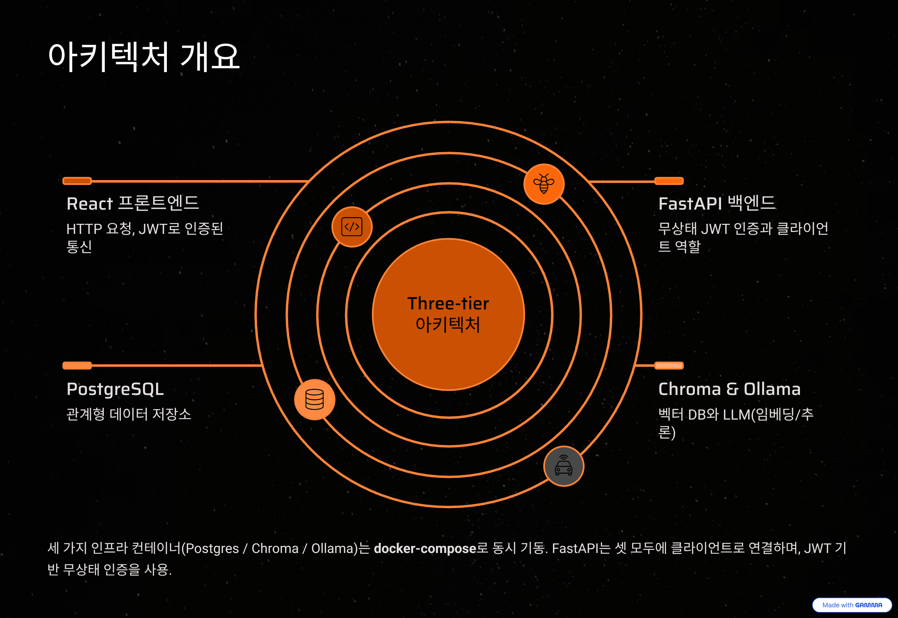
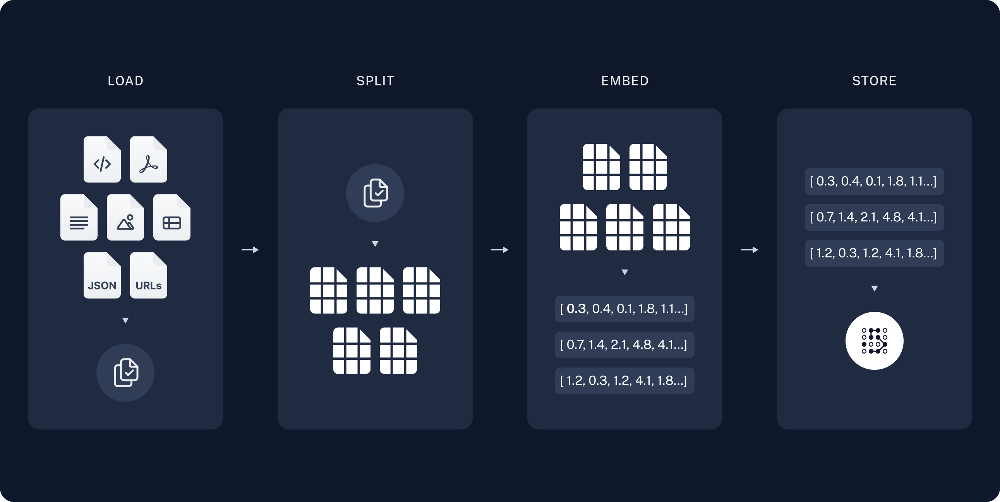
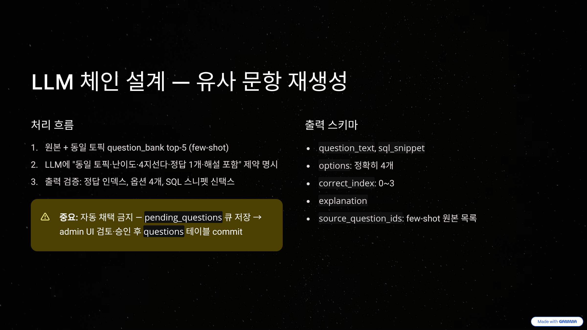

# SQLD.lab 백엔드 구축 계획

## Context

현재 [c:\sqld](c:\sqld\) 레포는 React + Vite + TypeScript 기반 프론트엔드만 존재하며, 모든 데이터는 [src/mocks/](src/mocks/) 하위 mock 함수로 공급되고 있다. 코드 곳곳의 `TODO` 주석(예: [src/store/mockExamStore.ts:55](src/store/mockExamStore.ts#L55), [src/pages/NotebookPage.tsx:56](src/pages/NotebookPage.tsx#L56))이 백엔드 연결 지점을 표시하고 있다.

이 프로젝트는 **SQLD 자격검정 학습 플랫폼**이며, 단순 CRUD를 넘어 **LLM 기반 개인화 약점 분석**과 **RAG 기반 유사 문항 재생성**을 차별 가치로 제시한다. 따라서 백엔드는 다음 두 축을 동시에 만족해야 한다.

1. **데이터 백엔드** — 사용자 / 모의고사 세션 / 오답노트 / 통계 영속화
2. **AI 백엔드** — 로컬 Ollama LLM + Chroma 벡터스토어 기반 RAG, 학습 분석 추론

사용자 결정 사항:
- **LLM 런타임**: Ollama (LangChain `ChatOllama`)
- **RAG 코퍼스**: SQLD 공식 교재 + 과거 기출 문제 은행
- **1차 LLM 기능**: 약점 분석 개인화 리포트, 유사 문항 재생성
- **저장소**: PostgreSQL(관계형) + Chroma(벡터) **분리**

---

## 아키텍처 개요



```
┌─────────────────┐         ┌──────────────────────────────┐
│  React (sqld/)  │ ──HTTP──▶│   FastAPI (sqld_backend/)   │
└─────────────────┘   JWT    │  ┌──────────┐  ┌──────────┐ │
                             │  │  routers │──│ services │ │
                             │  └──────────┘  └────┬─────┘ │
                             │       │             │       │
                             │       ▼             ▼       │
                             │  ┌──────────┐  ┌──────────┐ │
                             │  │   ORM    │  │   ai/    │ │
                             │  └────┬─────┘  └────┬─────┘ │
                             └───────┼─────────────┼───────┘
                                     ▼             ▼
                             ┌──────────────┐ ┌──────────┐ ┌────────┐
                             │ PostgreSQL   │ │  Chroma  │ │ Ollama │
                             │ (사용자/세션)│ │ (벡터DB) │ │  (LLM) │
                             └──────────────┘ └──────────┘ └────────┘
```

세 가지 인프라 컨테이너(Postgres / Chroma / Ollama)는 docker-compose로 동시 기동한다. FastAPI는 셋 모두에 클라이언트로 연결.

---

## 기술 스택


| 영역 | 선택 | 이유 |
| --- | --- | --- |
| 웹 프레임워크 | FastAPI + Uvicorn | async 지원, Pydantic 스키마 직결, OpenAPI 자동생성 |
| ORM | SQLAlchemy 2.0 (async) | 표준, Alembic 마이그레이션 |
| 마이그레이션 | Alembic | SQLAlchemy 표준 |
| 검증 | Pydantic v2 | FastAPI 통합, LangChain `with_structured_output` 호환 |
| 인증 | JWT (PyJWT) + passlib[bcrypt] | 표준, 무상태 |
| LLM 오케스트레이션 | LangChain (`langchain`, `langchain-ollama`, `langchain-chroma`) | 도구가 가장 풍부 |
| LLM 런타임 | Ollama (별도 컨테이너) | 사용자 결정 |
| 임베딩 | `bge-m3` (Ollama embed) | 한국어 강함, 8K 컨텍스트, 다국어 RAG에 최적 |
| 벡터DB | Chroma (PersistentClient, HTTP 모드) | 사용자 결정, LangChain 통합 |
| 관계DB | PostgreSQL 16 | 사용자 결정 |
| 패키지 매니저 | uv 또는 Poetry | uv 권장 (속도, lock) |
| 테스트 | pytest + pytest-asyncio + httpx | FastAPI TestClient 표준 |
| 컨테이너 | Docker Compose | 개발/배포 일관성 |

---


## 도메인 모델 (핵심만)

프론트의 [src/types/index.ts](src/types/index.ts)와 1:1 정렬. 각 ORM 모델은 동일 이름의 Pydantic 스키마(Read/Create/Update)와 짝.

| 테이블 | 핵심 컬럼 |
| --- | --- |
| `users` | id, email, password_hash, name, created_at |
| `topics` | id, subject(1\|2), name, display_order |
| `questions` | id, topic_id, difficulty, question_text, sql_snippet, explanation |
| `question_options` | id, question_id, display_order, option_text, is_correct |
| `mock_exams` | id, user_id, started_at, submitted_at, time_limit_sec, status, score, score_subject1, score_subject2 |
| `mock_exam_items` | id, exam_id, display_order, question_id, selected_option_id, is_correct, marked, time_spent_sec, change_count |
| `notebook_entries` | id, user_id, question_id, first_added_at, last_reviewed_at, review_count, mastered, memo |
| `weakness_reports` | id, user_id, generated_at, payload(jsonb), source_exam_ids(int[]) |

인덱스: `mock_exam_items(exam_id)`, `notebook_entries(user_id, mastered)`, `mock_exams(user_id, submitted_at desc)`.

---

## RAG 파이프라인



### 컬렉션 구성
| 컬렉션 | 출처 | 메타데이터 |
| --- | --- | --- |
| `sqld_textbook` | 교재 PDF/MD 청크 | `{source, topic_id?, subject, page}` |
| `question_bank` | DB `questions` 1행 = 1 도큐먼트 | `{question_id, topic_id, subject, difficulty}` |

### 청크/임베딩 정책
- 텍스트 분할: `RecursiveCharacterTextSplitter`, chunk=800, overlap=120 (한국어 기준 토큰화 고려)
- 임베딩: `OllamaEmbeddings(model="bge-m3")` — 차원 1024
- 인입 스크립트: `python -m app.ai.ingest.textbook` / `... .question_bank`
- 갱신: 신규 문항 등록 시 `question_bank` 재인덱스(서비스 레이어 hook)

### 검색 정책
- **약점 리포트**: 사용자가 자주 틀린 토픽으로 메타필터 → 교재 top-3 + 해설 top-3
- **유사 문항 생성**: 원본 문항의 임베딩 + 같은 `topic_id` 메타필터 → top-5

---

## LLM 체인 설계



LangChain LCEL 사용. 모든 출력은 **Pydantic으로 구조화**(`with_structured_output`)하여 파싱 실패 차단.

### 1) 약점 분석 리포트 (`ai/chains/weakness_report.py`)

**입력**:
- 최근 5회 모의고사 점수, 토픽별 정답률 (`stats_service`에서 집계)
- 자주 틀린 문항 ID 상위 N개 → 해당 문항의 `explanation`

**처리**:
1. 토픽별 정답률 < 60% 식별
2. 각 약점 토픽에 대해 `sqld_textbook` 검색 (top-3 chunks)
3. LLM에 컨텍스트 주입 → 구조화된 리포트 생성

**출력 스키마** (예):
```python
class WeaknessReport(BaseModel):
    summary: str  # 2-3문장 요약
    weak_topics: list[WeakTopic]  # {topic_name, accuracy, why, study_suggestion}
    next_steps: list[str]  # 3-5개 액션 아이템
    estimated_pass_prob: float  # 0~1
```

**캐싱**: `weakness_reports` 테이블에 user 단위 1행 upsert. 사용자가 새 시험 제출 시 invalidate.

### 2) 유사 문항 재생성 (`ai/chains/similar_question.py`)

**입력**: 원본 `question_id`

**처리**:
1. 원본 + 같은 토픽의 `question_bank` top-5 (few-shot 컨텍스트)
2. LLM에 "동일 토픽 / 동일 난이도 / 4지선다 / 정답 1개 / 해설 포함" 제약 명시
3. 출력 검증: 정답 인덱스 유효성, 옵션 4개, SQL 스니펫 신택스 체크(선택)

**출력 스키마**:
```python
class GeneratedQuestion(BaseModel):
    question_text: str
    sql_snippet: str | None
    options: list[GeneratedOption]  # exactly 4
    correct_index: int  # 0~3
    explanation: str
    source_question_ids: list[int]  # few-shot으로 쓴 원본들
```

**중요**: 자동 채택 금지 — `pending_questions` 큐에 저장 → admin UI에서 검토·승인 후 `questions` 테이블에 commit. 시험 품질 보호.
---

## 단계별 로드맵

| 단계 | 범위 | 산출물 | DoD |
| --- | --- | --- | --- |
| **P1. 인프라/스캐폴드** | docker-compose, FastAPI 앱, alembic, /health | 컨테이너 4개 기동, /docs 노출 | `curl /health` 200 |
| **P2. 인증** | User 모델, JWT, signup/login/me | 로그인 흐름 동작 | 프론트 `LoginPage`에서 실제 로그인 가능 |
| **P3. 도메인 CRUD** | Topic/Question/MockExam/Notebook 모델·라우터·시드 | 모의고사 시작→풀이→제출→오답노트 | 프론트 mocks/* 모두 fetch로 교체 가능한 상태 |
| **P4. 통계/대시보드** | stats_service, /stats/* | 대시보드 데이터가 실시간 집계 | 대시보드 KPI/차트 동작 |
| **P5-a. RAG 기반 마련** | Ollama 셋업, Chroma 컬렉션, 인입 스크립트 | textbook/question_bank 인입 완료 | `chroma_client.count()` 양호 |
| **P5-b. 약점 리포트** | `weakness_report` 체인 + `/ai/weakness-report` | 사용자별 캐시된 리포트 | E2E: 시험 제출→리포트 갱신 |
| **P5-c. 유사 문항 생성** | `similar_question` 체인 + 검토 큐 | admin 승인 워크플로 완료 | 1개 문항 변형→승인→`questions` 등록 |
| **P6. 프론트 wiring** | `src/mocks/*` 제거, fetch 클라이언트, 인증 가드, react-query 도입(권장) | 백엔드 풀 연동 | mock 코드 0줄 |
| **P7. 운영화** | 로깅(structlog), Sentry, 메트릭, 백업, CI 빌드 | 운영 가능 상태 | 배포 파이프라인 통과 |

---

## 검증 (E2E)

각 단계가 끝날 때 아래 시나리오로 통합 검증:

1. **P1**: `docker compose up` → `curl localhost:8000/health` 200, `localhost:8000/docs` 접속 가능
2. **P2**: signup → login → me 호출 → 토큰 만료/리프레시 동작
3. **P3**: 신규 모의고사 시작 → 50문항 응답 → 25개 응답 자동저장 → 제출 → 점수 채점 → 틀린 문항이 notebook에 자동 등록
4. **P4**: 대시보드 응답이 P3에서 제출한 시험 결과를 즉시 반영
5. **P5-a**: `python -m app.ai.ingest.textbook ./data/textbook/sqld.pdf` → Chroma에 문서 수 증가
6. **P5-b**: `POST /ai/weakness-report` → 토픽 정답률 < 60%인 항목이 `weak_topics`에 등장 + RAG로 가져온 교재 인용이 포함됨
7. **P5-c**: `POST /ai/similar-questions {question_id: 1, count: 3}` → pending 큐에 3건, admin 승인 1건 → `questions`에 신규 1건 추가됨
8. **테스트**: `pytest -v` 모두 통과 (LLM 호출은 `FakeListLLM`로 교체)

---